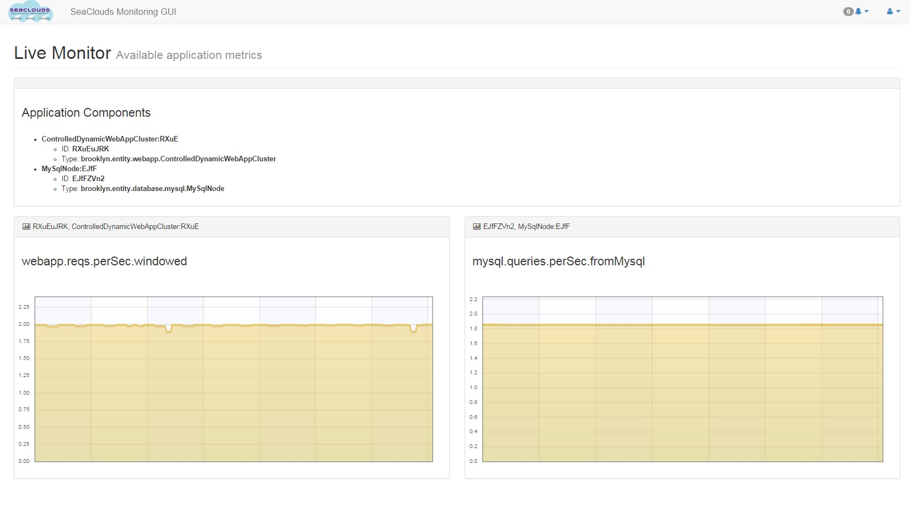

# Monitoring Platform for Pisa Meeting. NOT FOR RELEASE.



This dashboard is a proof of concept of SeaClouds Dashboard. 
This is a working progress release, a lot of bugs expected.


**NOTE:** BROOKLYN_ENDPOINT must be changed prior using it outside UMA Network.
**NOTE:** Sensor choice is not dynamic. It written directly in the app_monitor.html code,
also the array of sensor names, must match de entity order. For example:

```javascript
sensorNames = ["webapp.reqs.perSec.windowed", "mysql.queries.perSec.fromMysql"];
```